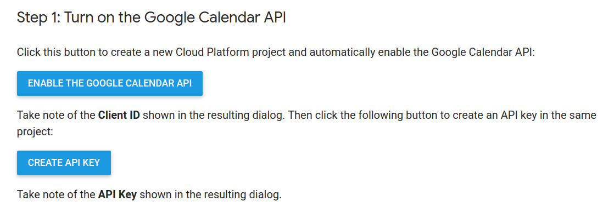

# Google Tasks Chat Visualization Example

## Google API credentials
You can enable google API and get `CLIENT_ID`, `TOKEN` from
https://developers.google.com/calendar/quickstart/js

## Install

1. Copy config file example.
```
cp config.js.example config.js
```
2. Setup **config.js** options: `API_KEY`, `CLIENT_ID`.


## Running

* With Python 2.
> Go to the project working directory and run python server.
```
python -m SimpleHTTPServer 8000
```
* With NodeJS https://stackoverflow.com/a/16350826/2506123
```
# Installing NodeJS HTTP Server
npm install http-server -g
# Running HTTP Server on the working directory (just replace {WORKING_DIRECTORY} with your real path to the project)
http-server {WORKING_DIRECTORY}
```